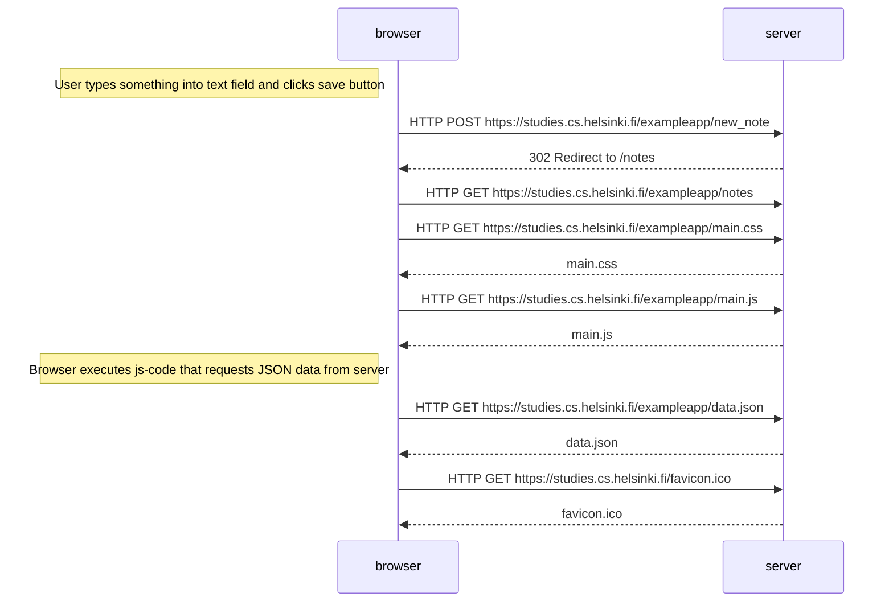

# Exercise 0.4

```mermaid
sequenceDiagram
    participant browser
    participant server

    Note left of browser: User types something into text field and clicks save button

    browser->>server: HTTP POST https://studies.cs.helsinki.fi/exampleapp/new_note
    server-->>browser: 302 Redirect to /notes
    browser->>server: HTTP GET https://studies.cs.helsinki.fi/exampleapp/notes
    browser->>server: HTTP GET https://studies.cs.helsinki.fi/exampleapp/main.css
    server-->>browser: main.css
    browser->>server: HTTP GET https://studies.cs.helsinki.fi/exampleapp/main.js
    server-->>browser: main.js

    Note left of browser: Browser executes js-code that requests JSON data from server
    
    browser->>server: HTTP GET https://studies.cs.helsinki.fi/exampleapp/data.json
    server-->>browser: data.json
    browser->>server: HTTP GET https://studies.cs.helsinki.fi/favicon.ico
    server-->>browser: favicon.ico
```
