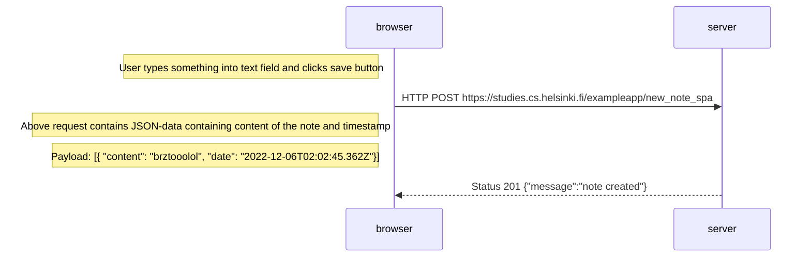

# Exercise 0.6

```mermaid
sequenceDiagram
    participant browser
    participant server

    Note left of browser: User types something into text field and clicks save button

    browser->>server: HTTP POST https://studies.cs.helsinki.fi/exampleapp/new_note_spa

    Note left of browser: Above request contains JSON-data containing content of the note and timestamp
    
    Note left of browser: Payload: [{ "content": "brztooolol", "date": "2022-12-06T02:02:45.362Z"}]

    server-->>browser: Status 201 {"message":"note created"}
```
