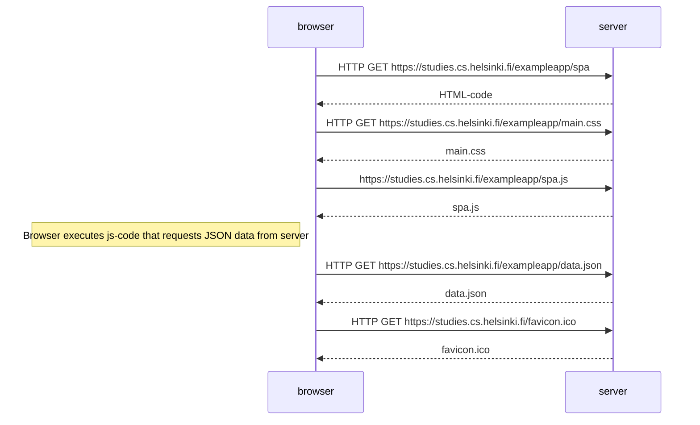

# Exercise 0.5

```mermaid
sequenceDiagram
    participant browser
    participant server

    browser->>server: HTTP GET https://studies.cs.helsinki.fi/exampleapp/spa
    server-->>browser: HTML-code
    browser->>server: HTTP GET https://studies.cs.helsinki.fi/exampleapp/main.css
    server-->>browser: main.css
    browser->>server: https://studies.cs.helsinki.fi/exampleapp/spa.js
    server-->>browser: spa.js

    Note left of browser: Browser executes js-code that requests JSON data from server

    browser->>server: HTTP GET https://studies.cs.helsinki.fi/exampleapp/data.json
    server-->>browser: data.json
    browser->>server: HTTP GET https://studies.cs.helsinki.fi/favicon.ico
    server-->>browser: favicon.ico
```
